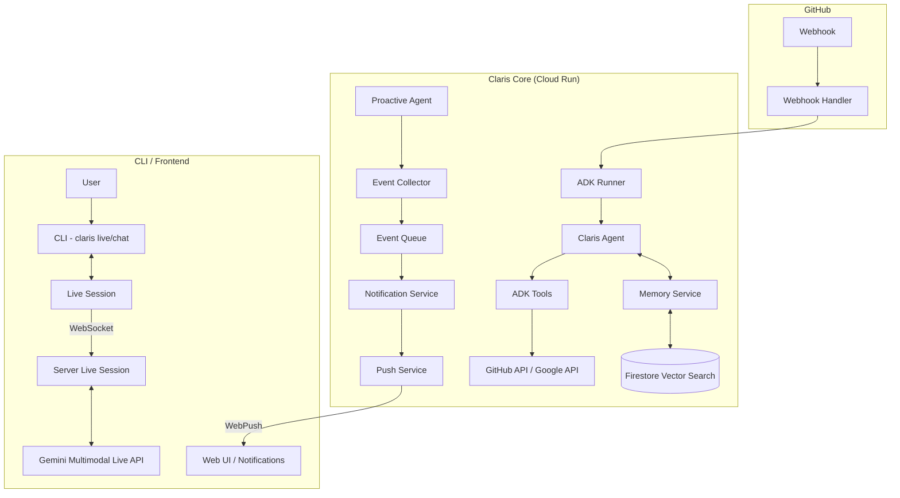

# Claris Project Walkthrough 🌸

**最終更新**: 2026-01-21 09:20 JST
**ステータス**: ✅ 完成・本番稼働中

---

## 🎯 プロジェクト概要

**Claris** は GitHub PR を自動レビューする AI エージェント。Google Cloud Japan AI Hackathon Vol.4 向けに開発。

| 項目 | 値 |
|:-----|:---|
| **リポジトリ** | [blacpans/claris](https://github.com/blacpans/claris) |
| **本番URL** | `https://<YOUR_APP_DOMAIN>` |
| **Webhook URL** | `https://<YOUR_APP_DOMAIN>/webhook` |
| **Cloud Run** | `<YOUR_CLOUD_RUN_URL>` |
| **GCPプロジェクト** | `<YOUR_PROJECT_ID>` |

---

## 🏗️ アーキテクチャ



### 主要ディレクトリ構成

| ディレクトリ | 役割 |
|:---------|:-----|
| `src/agents/` | エージェントの性格定義やプロンプト管理 |
| `src/cli/` | `claris` コマンドの実装（auth, chat, live 等） |
| `src/core/` | システムの中核（Live, Memory, Proactive, Auth 等） |
| `src/tools/` | ADK を使った外部連携ツール（Git, Google API 等） |
| `src/runtime/` | サーバー、Webhook、WebSocket などのランタイム処理 |
| `src/config/` | 環境変数やモデル、デフォルト値の設定 |
| `src/sessions/` | Firestore を使ったセッション永続化 |
| `src/constants/` | メッセージ文言などの定数管理 |
| `src/utils/` | 共通ユーティリティ |

---

## ⚙️ 環境設定

### Secret Manager

| シークレット名 | 説明 |
|:---------------|:-----|
| `GITHUB_TOKEN` | GitHub PAT (`repo` scope) |
| `GEMINI_MODEL` | `gemini-3-pro-preview` (version 4) |
| `GITHUB_WEBHOOK_SECRET` | Webhook署名検証用シークレット |

### Cloud Run 環境変数

| 変数名 | 値 |
|:-------|:---|
| `GOOGLE_CLOUD_PROJECT` | `<YOUR_PROJECT_ID>` |
| `GOOGLE_CLOUD_LOCATION` | `global` ⚠️ gemini-3-pro-preview に必須 |

### IAM 権限 (Service Account: `<YOUR_SERVICE_ACCOUNT_EMAIL>`)

- `roles/datastore.user` (Firestore)
- `roles/aiplatform.user` (Vertex AI)
- `roles/secretmanager.secretAccessor` (Secret Manager)

---

## 🔧 解決した問題

1. **ESM Module Resolution**: `tsconfig.json` で `moduleResolution: "NodeNext"` + `.js` 拡張子必須
2. **Firestore undefined エラー**: `ignoreUndefinedProperties: true` + `removeUndefined()` ヘルパー
3. **gemini-3-pro-preview 404**: `GOOGLE_CLOUD_LOCATION=global` が必須 (us-central1 では動かない)

---

## 🚀 今後の改善タスク

- [x] ~~Webhook Secret 設定 (`GITHUB_WEBHOOK_SECRET`) - セキュリティ強化~~ ✅
- [ ] Cloud Tasks / Pub/Sub でバックグラウンド処理を堅牢化
- [ ] Line-by-line コメント機能 (`POST /repos/{owner}/{repo}/pulls/{pull_number}/comments`)
- [ ] エラーハンドリング改善 (Slack/Discord 通知)
- [ ] テストコード追加

---

## 📝 デプロイ方法

```bash
cd ~/ghq/github.com/blacpans/claris

# GOOGLE_CLOUD_PROJECT が環境変数で設定されていること
./deploy/deploy.sh
```

> **Note**: 初回デプロイ時は Secret Manager に以下のシークレットを作成しておくこと:
> - `GITHUB_TOKEN`
> - `GEMINI_MODEL`
> - `GITHUB_WEBHOOK_SECRET`

---

## 🔗 関連リソース

- [PR #1](https://github.com/blacpans/claris/pull/1) - テスト用PR (Clarisのレビューコメントあり)
- [Cloud Run Console](https://console.cloud.google.com/run/detail/us-central1/claris/metrics?project=<YOUR_PROJECT_ID>)
- [Cloud Logging](https://console.cloud.google.com/logs/query?project=<YOUR_PROJECT_ID>)
