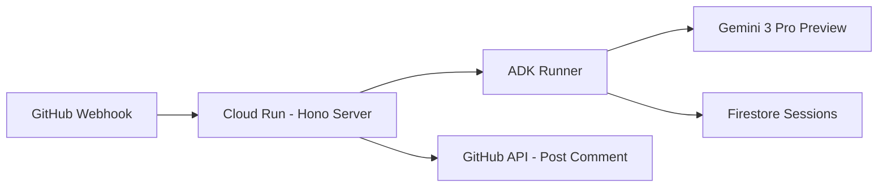

# Claris Project Walkthrough 🌸

**最終更新**: 2026-01-21 09:20 JST
**ステータス**: ✅ 完成・本番稼働中

---

## 🎯 プロジェクト概要

**Claris** は GitHub PR を自動レビューする AI エージェント。Google Cloud Japan AI Hackathon Vol.4 向けに開発。

| 項目 | 値 |
|:-----|:---|
| **リポジトリ** | [blacpans/claris](https://github.com/blacpans/claris) |
| **本番URL** | https://claris.blacpans.net |
| **Webhook URL** | `https://claris.blacpans.net/webhook` |
| **Cloud Run** | `claris-647030459554.us-central1.run.app` |
| **GCPプロジェクト** | `upheld-beach-482910-e6` |

---

## 🏗️ アーキテクチャ



### 主要ファイル

| ファイル | 役割 |
|:---------|:-----|
| `src/index.ts` | エントリーポイント |
| `src/runtime/server.ts` | Hono HTTP サーバー |
| `src/runtime/webhook.ts` | GitHub Webhook ハンドラー |
| `src/runtime/runner.ts` | ADK Runner (セッション管理) |
| `src/agents/claris.ts` | Claris エージェント定義 |
| `src/sessions/firestoreSession.ts` | Firestore セッション永続化 |
| `src/tools/git/github.ts` | GitHub API ツール群 |

---

## ⚙️ 環境設定

### Secret Manager

| シークレット名 | 説明 |
|:---------------|:-----|
| `GITHUB_TOKEN` | GitHub PAT (`repo` scope) |
| `GEMINI_MODEL` | `gemini-3-pro-preview` (version 4) |

### Cloud Run 環境変数

| 変数名 | 値 |
|:-------|:---|
| `GOOGLE_CLOUD_PROJECT` | `upheld-beach-482910-e6` |
| `GOOGLE_CLOUD_LOCATION` | `global` ⚠️ gemini-3-pro-preview に必須 |

### IAM 権限 (Service Account: `647030459554-compute@developer.gserviceaccount.com`)

- `roles/datastore.user` (Firestore)
- `roles/aiplatform.user` (Vertex AI)
- `roles/secretmanager.secretAccessor` (Secret Manager)

---

## 🔧 解決した問題

1. **ESM Module Resolution**: `tsconfig.json` で `moduleResolution: "NodeNext"` + `.js` 拡張子必須
2. **Firestore undefined エラー**: `ignoreUndefinedProperties: true` + `removeUndefined()` ヘルパー
3. **gemini-3-pro-preview 404**: `GOOGLE_CLOUD_LOCATION=global` が必須 (us-central1 では動かない)

---

## 🚀 今後の改善タスク

- [ ] Webhook Secret 設定 (`GITHUB_WEBHOOK_SECRET`) - セキュリティ強化
- [ ] Cloud Tasks / Pub/Sub でバックグラウンド処理を堅牢化
- [ ] Line-by-line コメント機能 (`POST /repos/{owner}/{repo}/pulls/{pull_number}/comments`)
- [ ] エラーハンドリング改善 (Slack/Discord 通知)
- [ ] テストコード追加

---

## 📝 デプロイ方法

```bash
cd ~/ghq/github.com/blacpans/claris

gcloud run deploy claris \
  --source . \
  --project upheld-beach-482910-e6 \
  --region us-central1 \
  --allow-unauthenticated \
  --set-secrets "GITHUB_TOKEN=GITHUB_TOKEN:latest,GEMINI_MODEL=GEMINI_MODEL:latest" \
  --set-env-vars "GOOGLE_CLOUD_PROJECT=upheld-beach-482910-e6,GOOGLE_CLOUD_LOCATION=global"
```

---

## 🔗 関連リソース

- [PR #1](https://github.com/blacpans/claris/pull/1) - テスト用PR (Clarisのレビューコメントあり)
- [Cloud Run Console](https://console.cloud.google.com/run/detail/us-central1/claris/metrics?project=upheld-beach-482910-e6)
- [Cloud Logging](https://console.cloud.google.com/logs/query?project=upheld-beach-482910-e6)
